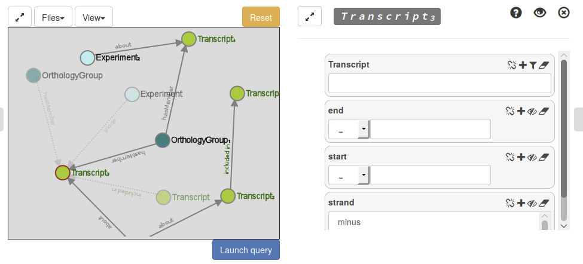

AskOmics
========

.. image:: https://travis-ci.org/askomics/askomics.svg?branch=master
    :target: https://travis-ci.org/askomics/askomics

.. image:: https://coveralls.io/repos/github/askomics/askomics/badge.svg?branch=master
    :target: https://coveralls.io/github/askomics/askomics?branch=master

.. image:: https://img.shields.io/docker/pulls/askomics/askomics.svg
    :target: https://hub.docker.com/r/askomics/askomics/

.. image:: https://readthedocs.org/projects/askomics/badge/?version=latest
    :target: http://askomics.readthedocs.io/en/latest/?badge=latest

AskOmics is a visual SPARQL query interface supporting both intuitive data integration and querying while shielding the user from most of the technical difficulties underlying RDF and SPARQL

Some (possibly outdated) documentation is also on the `AskOmics Wiki <https://github.com/askomics/askomics/wiki>`_. It should be imported here some day.

.. toctree::
   :maxdepth: 2

   README
   deployment
   usage
   devdoc
   abstraction
   api/askomics

Indices and tables
==================

* :ref:`genindex`
* :ref:`modindex`
* :ref:`search`
