# AskOmics tutorial

## User account

### Account creation

To use AskOmics, you will need an account. Go to the signup page by clicking to the login tab.

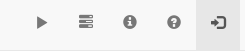

Then, click to the signup link.

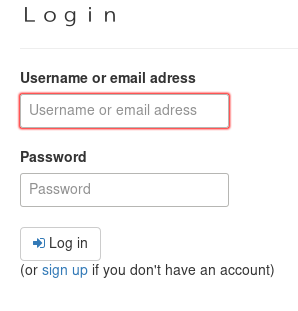

fill the form with the requested information.

### Account management

To manage your account, use the account management tab.

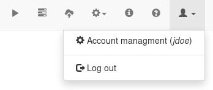

#### Update information

This section allow you to change your email address and your password.

#### API key

the API key ensures the connection of AskOmics with third-party applications (like Galaxy).

Updating the API key will revoke existing accesses.

#### Galaxy account

Link a Galaxy account to use Galaxy datasets into AskOmics.

#### Account deletion

The account deletion is final, all your information, as well as all your data will be deleted.

## Use case 1: Gene expression

All files needed for the tutorial are available [here](https://github.com/askomics/demo-data/tree/master/Tutorials/Tuto1)

3 files are provided:

- gene.tsv: Gene location on a genome
- orthogroup.tsv: group of ortholog genes
- differential_expression.tsv: results of differential expression experiences

### Files organization

AskOmics take as inputs CSV files. But these files have to respect a certain structure.

A CSV file describe an **entity**. The entity name is displayed in the first header on the file. Entity name of the file `gene.tsv` is *Gene*.

Other headers describe the entity **attributes** and **relations**. An attributes is a simple columns one a file. For example, *Gene* have 5 attributes: *organism*, *chromosome*, *strand*, *start* and *end*. A relation is described by a header like *relation_name@entity*. On the `orthogroup.tsv` file, *Orthogroup* entity have a *concerns* relation. This relation target the *Gene* entity.

### Upload files

First step is to upload your CSV files into AskOmics. Click on the *upload* tab to go to the upload page.

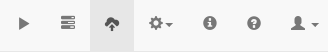

On the upload page, use the *Upload* button, and add the 3 files into the upload queue. Then, start uploading the files.

The CSV files are now uploaded on AskOmics.

### Integrate files

On the upload page, select the file to integrate, and click to the *Integrate* button. AskOmics shows an overview of the file.

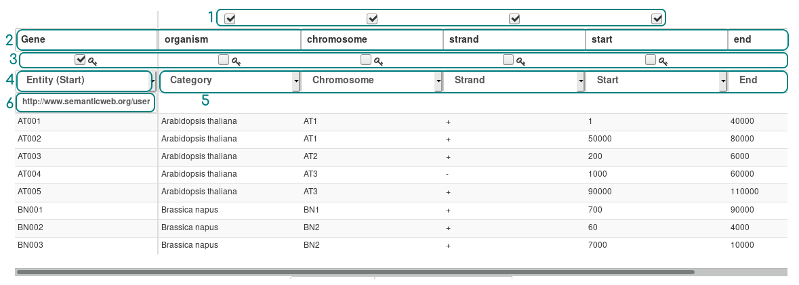

1. Columns disabler: ucheck columns to ignore them
2. Header updater: optionally update entity or attribute names
3. Key columns: check several columns to create a new one by concatenate the columns checked
4. Entity type: choose between simple entity or entity start (default). An entity start will be displayed one the startpoint page.
5. Attributes types: select the attributes types (see bellow)
6. Custom URI: update the attributes URI (advanced feature)

Attributes can be one of the following types:

- Attributes
    * Numeric
    * Text
    * Category
    * Date/time
- Positionable attributes
    * Taxon
    * Chromosome
    * Strand
    * Start
    * End
- Relation
    * General relation to entity
    * Symmetric relation to entity

Types are automatically detected by AskOmics, but you can override them if needed.

### Interrogate datasets

Once you have integrated all the datasets, it's time to query them.

Click on the *Ask* button

The page show you the starting points of you query. Select The *Gene* entity and start a query.

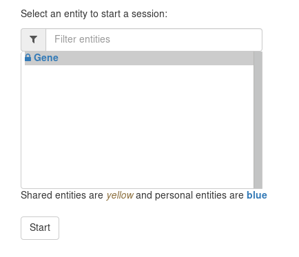

The *query builder* is composed of two view: the *left view*, representing entities and their relations, and the *right view*, representing attributes of the selected entity.

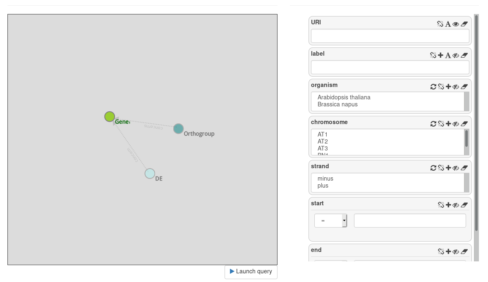

On the left view, the *Gene* entity is selected. We see two transparent node: *Orthogroup* and *DE*. This two node are proposed, but not instantiated.

On the right view, attributes of *Gene* are displayed on **attributes cells**.

#### Simple query

Click on *Launch query* to perform a query. It leads to the job page, query section. Click on the query to display an preview of the results.

Results show all the *gene* URI present on the triplestore.

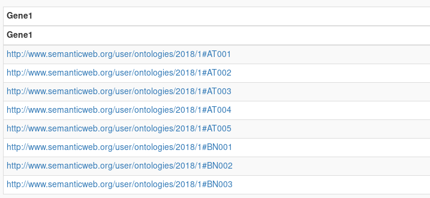

### Display attributes

Return to the query builder (*Ask* tab). Now, we want to display some attributes of the genes.

On the right view, all attributes have button. Click on the *eye* button to display attributes.

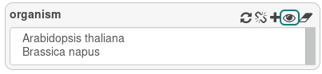

The eye take 3 states:

- closed eye: hide the attribute
- open eye: show the attribute
- question mark: show the attribute, even if there is not

Show the *organism*, *start* and *end* and launch the query.

Results are all gene with their *organism*, *start* and *end*.

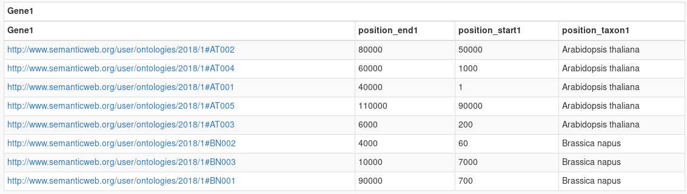

### Filter on attributes

Attributes can be filtered according their type (numeric, categorical or text). Some filtering functionality are common to all the attributes

- Negation: the + icon
- canel filter: use the rubber icon to reset the field
- Link: the chain link link an attributes to the same attributes on another node

#### Text

Go back to the query builder. To filter on a text attributes, enter some test in the field.

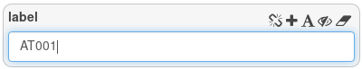

Here, we ask for all entity that match the string `AT001`. This query will return one result.

You can also perform a regular expression filter by clicking on the A icon (this will change the icon into a funnel).

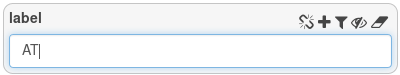

We ask for all genes whose label contains the `AT` string. This will return 5 results.

#### Numeric

go back to the query builder and reset the label filter by clicking to the rubber icon.

Filter the start attribute to get all genes with a start position larger than 6000.

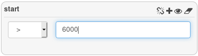

3 genes are returned.

#### Category

Category is an attributes that have a limited number of value. Here, *strand* , *chromosome* and *taxon* are categories.

On the query builder, filter the organism to get all *Arabidopsis thaliana* gene.

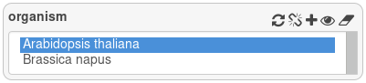

5 genes are returned.

### Link data

Back on the query builder, we will now cross *Gene* with *DE* and *Orthogroup*

Reset the query by clicking on the *Reset* button.

Start a new query with *DE*. This datasets contain results of differentials expressions that concerns genes. Display Dpi (day post infection) and trend by clicking the eye on the attributes cells.

Then, instantiate the *Gene* node by clicking on it. Display *organism* and filter only the *Arabidopsis thaliana genes*.

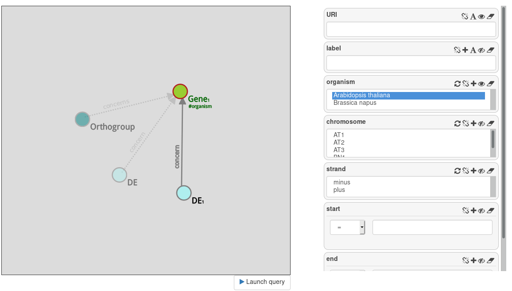

This query gives you all differentials expressions measures that concerns *Arabisopsis thaliana* species.

Go back to the *DE* node and filter attributes to get only genes that are overexpressed at day 7.

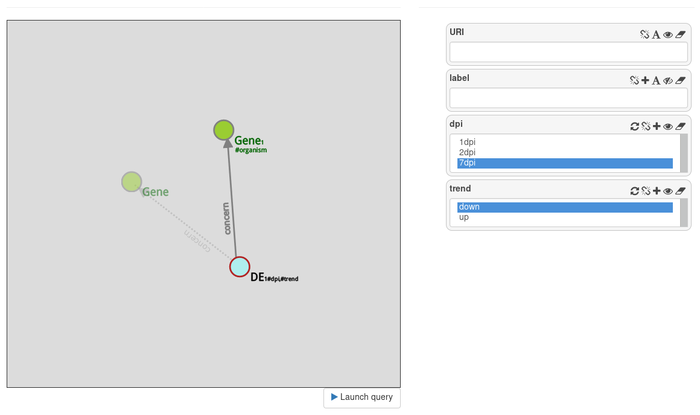

This query return 5 results.

Now, we want genes of *Brassica napus* that are ortholog the the *Arabidopsis thaliana* genes that are overexpressed at day 7.

Instanciate a *Orthogroup* node from the *Gene*. From this *Orthogroup* node, instanciate another *Gene* node, and filter it with *Brassica napus*.

We have 2 genes returned

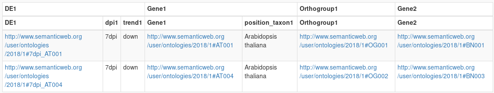

Well done, you have complete the AskOmics tutorial! Now try with your data.

### Save a query state

On the query builder page, use the *Files > Save Query* to save the graph state into your computer. This file represent the state of the query.

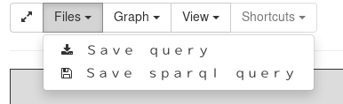

Then, on the ask page, you can upload a query file to work on your query again.

### Download the results

The job page show you only a preview of the results. To download the full results, click on *Save* to download a CSV file with the results.

## Use AskOmics with Galaxy

[Galaxy](https://galaxyproject.org/) is an open source, web-based platform for data intensive biomedical research. You can integrate Galaxy datasets into AskOmics by linking a Galaxy account into AskOmics.

### Link Galaxy account into AskOmics

In you galaxy account, copy your Galaxy API key (User > Preferences > Manage API key).

Back in AskOmics, go to Account Management and add the Galaxy URL and Galaxy API key

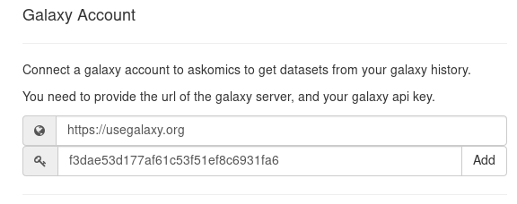

### Upload a Galaxy datasets into AskOmics

On the upload page, you can now upload a Galaxy datasets with the button *Get from Galaxy*.

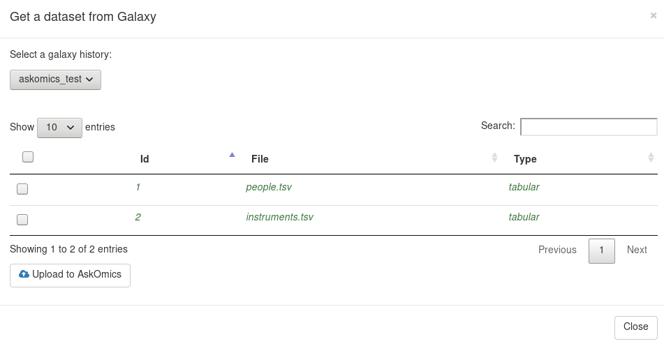

### Save query state into Galaxy history

On the query builder page, you can save a query state into a galaxy history. You can also start a query with a saved state from galaxy on the ask page.

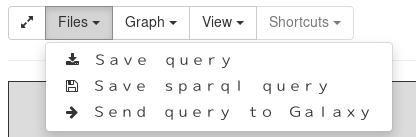

### Save query results into Galaxy history

Result can be send into galaxy on the job page. Use the *Send to Galaxy* button.

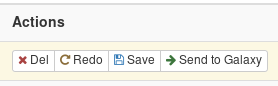

